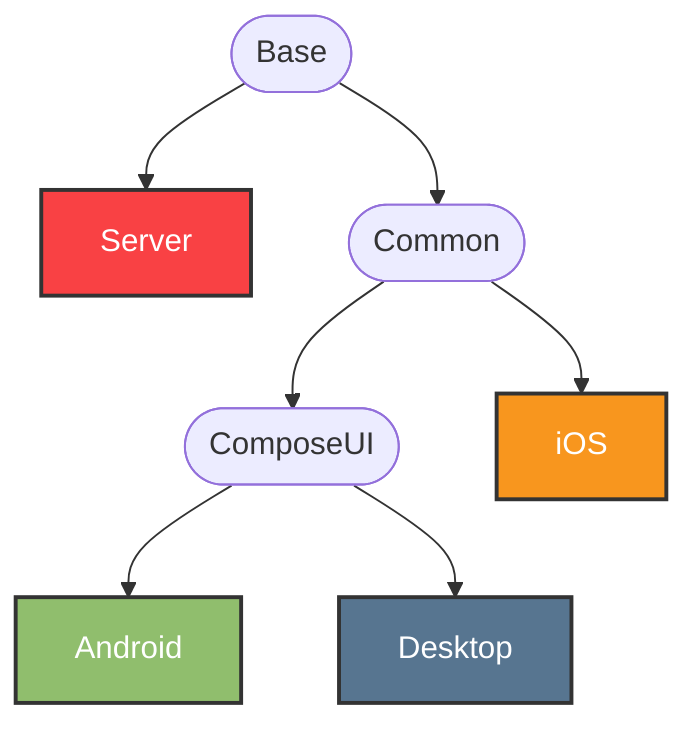
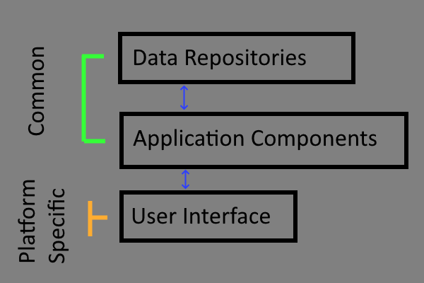

# Development

## Running The App

There are several run configurations provided for IntelliJ, stored in `/.run`.

### Desktop App

`gradlew :desktop:run --args='--dev'` This will run in development mode. To run in developmeny mode manually, simply
pass `--dev` as an
argument when running it. Passing nothing will run in release mode.

`dev` mode will use a separate config directory so that you don't accidentally mess with production data.

### Android App

Select the `Android` run target in the IDE and run it.

You can install the development version alongside a production version, they will have different names and icons so you
can tell them apart.

### Running the Server

`gradlew server:run`

## Running Tests

Our mocking library [mockk](https://mockk.io/) does not yet support Kotlin/Native, thus we need to choose one of the **JVM** targets to
write the tests for. We chose desktop:

`gradlew desktopTest`

And for the Server:

`gradlew server:test`

#### Checking code coverage

`gradlew koverHtmlReport`

The results of which will be here:
[Code Coverage Report](./build/reports/kover/html/index.html)

## Writing Tests

### `Common` Module Tests:

Most tests live in the `desktopTest` source set, but a few do live in `commonTest`

#### Testing utilities:

`BaseTest` sets you up for injecting with Koin and dealing with coroutines for testing.

`TestProjectUtils.kt` has functions for generating test data.

### `ComposeUI` Module Tests:

Again, most tests live in the `desktopTest` source set, but a few live in `commonTest`

Useful reference for UI
testing: [Compose Test Cheatsheet](https://developer.android.com/reference/kotlin/androidx/compose/ui/test/package-summary)

## Overal Project Structure (modules)


## Client Development

### Client Architecture



### Coroutines

### Repository Layer

Repositories will need to declare their own coroutine scope, there is no common base class to do so.
```kotlin
	// The various dispatcher can be injected as such
	private val mainDispatcher by injectMainDispatcher()
	private val defaultDispatcher by injectDefaultDispatcher()
	private val ioDispatcher by injectIoDispatcher()
```

#### Component layer
Component base class `ComponentBase` has a coroutine scope defined already: `scope`

This scope will be canceled for you when the component is destroyed.

You can inject the various contexts as such:
```kotlin
	private val mainDispatcher by injectMainDispatcher()
	private val defaultDispatcher by injectDefaultDispatcher()
	private val ioDispatcher by injectIoDispatcher()

	// `scope` here is from the `ComponentBase` parent class
	scope.launch {
        // Scope uses the default dispatcher, so make sure to switch contexts when necessary
        withContext(mainDispatcher) {
			// Make sure you update all of your state variables on the main thread
		}
	}
```

#### UI Layer: Compose
```kotlin
	// Define your own, or use scope hoisting to a parent Composable
	val scope = rememberCoroutineScope()

	// inject which ever dispatcher you need
	val mainDispatcher = rememberMainDispatcher()
val defaultDispatcher = rememberDefaultDispatcher()
val ioDispatcher = rememberIoDispatcher()

scope.launch(defaultDispatcher) {
	// Do stuff in background
	withContext(mainDispatcher) {
		// Back on main thread
	}
}
```

## Logging

## Client

On the client you can log using `Napier` it works on all supported platforms:

```kotlin
Napier.i("message")
Napier.w("message")
Napier.e("message")
Napier.d("message")
```

## Server

On server you can log anywhere you have access to the ktor `Application`

```kotlin
log.info("message")
log.debug("message")
```

You can also access it from a ktor `Call` object:
`call.application.environment.log.info("Hello from a Call!")`

If you need logging below the HTTP layer 🤷 Pass the logger down? Idk we don't have a great solution
for this yet.

## Synchronization

The protocol for synchronizing data between client and server is outlined here:
[SYNCING-PROTOCOL.md](docs/SYNCING-PROTOCOL.md)

## How to Release

- Make sure your local repository is in a clean state, nothing outstanding
- Change branch to `develop`
- When `develop` is ready to release, run: `./gradlew prepareForRelease`
	- This will prepare your repo by doing the following:
		- Increment app version `app` in `libs.versions.toml`
		- Add new changelog in `fastlane\metadata\android\en-US\changelogs` called `n.txt` where `n` is
		  the android version code
		- Merge `develop` into `release`
		- Tag the latest commit to make the release from in the [semvar](https://semver.org) format
		  of `v1.1.1`
		- Push to origin
- This will trigger the `release` action on GitHub which will create a new **Release**, and build
  all the artifacts
- Once the `release` action is complete open the new **Release** on GitHub
- Click _Edit_
- Uncheck "_Set as a pre-release_" and instead check "_Set as the latest release_"
- Click the **Publish Release** button
- This will trigger the `publish` action which will upload artifacts to stores, deploy
  to [hammer.ink](https://hammer.ink), and notify the **Discord** channel of a new release
- All done!

## Re-generate open source library data

This is a manual step that needs to be run any time a new Open Source library is added.
This data drives the Opensource Licences UI in the apps.

**Android Target:**
`./gradlew :android:exportLibraryDefinitions -P"aboutLibraries.exportPath=src\main\res\raw"`

**Desktop Target:**
`./gradlew :desktop:exportLibraryDefinitions -P"aboutLibraries.exportPath=src\jvmMain\resources"`

**iOS Target:**
???
