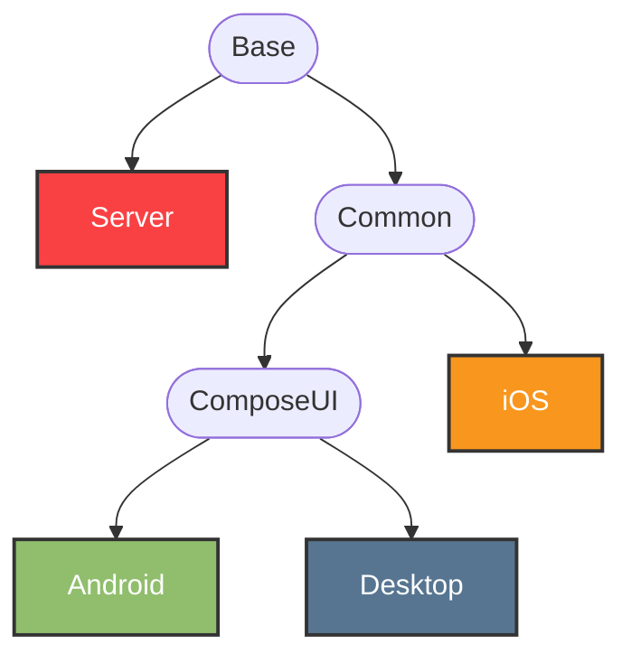

# Development

## Running The App

There are several run configurations provided for IntelliJ, stored in `/.run`.

### Desktop App

`gradlew :desktop:run --args='--dev'` This will run in development mode. To run in developmeny mode manually, simply
pass `--dev` as an
argument when running it. Passing nothing will run in release mode.

`dev` mode will use a separate config directory so that you don't accidentally mess with production data.

### Desktop App with Hot Reload

`gradlew :desktop:hotRunJvm -PhotReload --auto` runs the desktop app under
[Compose Hot Reload](https://github.com/JetBrains/compose-hot-reload); saving a file re-composes the running UI.
Drop `--auto` to trigger reloads explicitly with `gradlew :desktop:reload -PhotReload`.

`-PhotReload` is mandatory, and it changes how the app is assembled:

- The app runs on Nucleus' AWT backend instead of Tao (`-Dhammer.desktop.backend=awt`, read by `selectBackend()`
  in `Main.kt`). Hot Reload instruments `ComposeWindow.setContent`, which the Tao backend never calls, so under Tao
  it sees no windows at all.
- `nucleus.decorated-window-tao` is swapped for `nucleus.decorated-window-jbr`. Tao has to leave the classpath
  entirely, not just go unused: it registers a `MainDispatcherFactory` service that pins `Dispatchers.Main` to
  Tao's thread unconditionally, which makes AndroidX Lifecycle throw on the AWT event thread.

Window decorations therefore come from a different implementation than in a packaged build. Everything above the
window level is the same code.

`.mcp.json` exposes the Compose Hot Reload MCP server (`:desktop:hotMcpServerJvm`) to AI agents: reload, read the
semantic tree, take screenshots, and drive the UI. Start the app first; the server connects to whatever is running
and does not need `-PhotReload` itself.

On Wayland, `take_screenshot` goes through `java.awt.Robot`, which JBR routes to the xdg-desktop-portal screen
share prompt. The first capture blocks until you approve it; tick "Remember This Selection" or every screenshot
prompts again. `get_semantic_tree` needs no permission and is usually the more useful tool anyway.

### Android App

Select the `Android` run target in the IDE and run it.

You can install the development version alongside a production version, they will have different names and icons so you
can tell them apart.

### Running the Server

`gradlew server:run`

## Running Tests

Our mocking library [mockk](https://mockk.io/) does not yet support Kotlin/Native, thus we need to choose one of the **JVM** targets to
write the tests for. We chose desktop:

`gradlew desktopTest`

And for the Server:

`gradlew server:test`

#### Checking code coverage

`gradlew koverHtmlReport`

The results of which will be here:
[Code Coverage Report](./build/reports/kover/html/index.html)

## Writing Tests

### Testing Philosophy

We follow the **classical school** of unit testing (Khorikov). The two qualities every test is
judged on:

1. **Detection power** — the test *can* fail, and fails when the behavior it describes breaks.
2. **Resistance to refactoring** — the test *doesn't* fail when behavior is preserved but the
   implementation changes.

In practice:

- **Test observable behavior, not implementation details.** Assert on component state, returned
  values, emitted flows, files written, callbacks fired — never on private fields, internal
  ordering, or "method X called method Y".
- **Test units of *behavior*, not units of code.** Our tests look more like small integration
  tests than mock-everything unit tests, and that's intentional.
- **Prefer real collaborators and fakes over mocks.** Real repositories over okio
  `FakeFileSystem` with real serializers are cheap here. Mock only out-of-process boundaries
  (HTTP, DAOs) and heavy orchestrator seams. When you do mock, make stubs **argument-specific**
  and verifications **argument-exact** — an all-`any()` stub that the test then echoes back
  proves nothing.
- **AAA structure** (Arrange, Act, Assert), readable and maintainable.

Anti-patterns that keep sneaking in (each of these was found and fixed in a repo-wide audit —
don't reintroduce them):

- **Assertions that can't fail:** `assertNotNull` on a non-nullable value, `x >= before` on a
  monotonic value, asserting a size without asserting the contents, tests with no assertions
  at all.
- **`verify { mock.method(any()) }` as the only assertion.** It proves a call happened, not that
  it did the right thing. Capture the argument (MockK `slot`) and assert on its effect.
- **Echoing the stub:** `coEvery { x() } returns Y` then `assertEquals(Y, callX())` is only
  meaningful if the stub is argument-specific or the value is transformed.
- **Self-invoked callbacks:** calling the component's own listener and asserting the state equals
  what you just passed bypasses the wiring under test. Drive the test through the callback the
  component registered on its collaborator.
- **Half a round trip:** "store succeeded" without reading back what was stored; "returns
  success" without checking anything was persisted; "loading started" without completing the
  fake flow and asserting it finished.
- **Pinning incidentals:** exact call counts where the behavior is just "it happens"
  (keep `exactly = 0` when "nothing happens" *is* the contract), internal ordering,
  locale/timezone-dependent formatting (assert the stable part), or production string literals
  copy-pasted into the test (extract a shared constant instead).
- **Kotlin's `assert()`** — it's a no-op unless the JVM runs with `-ea`. Use `kotlin.test`
  assertions.

**Test-driven bug fixing:** when fixing a bug, first write a test that reproduces it, watch it
fail, then fix the bug and watch it pass.

### `Common` Module Tests:

Most tests live in the `desktopTest` source set, but a few do live in `commonTest`

#### Testing utilities:

`BaseTest` sets you up for injecting with Koin and dealing with coroutines for testing
(`runTest(mainTestDispatcher)` + `advanceUntilIdle()` drive everything on one scheduler).

`TestProjectUtils.kt` has functions for generating test data.

For component tests, extend `utils.ComponentTest`: it provides a real `TestComponentContext`
(call `context.resume()` after constructing your component), a `projectDef`, and
`setupComponentKoin(module)`. Dependencies a component gets via `by projectInject()` must be
registered inside `scope<ProjectDefScope> { scoped { … } }`; plain `by inject()` deps go in the
module root.

Hard-won gotchas:

- **Relaxed-mock Flow properties crash on collect** with `KotlinNothingValueException`. Stub
  every collected `Flow`/`SharedFlow`/`StateFlow`/`Channel` property with a real instance
  (`MutableSharedFlow()`, `MutableStateFlow(...)`, `Channel()`).
- **`TestScope.backgroundScope` collectors never subscribe under `BaseTest`** — collect with a
  plain `launch` and cancel it at the end of the test.
- If `desktopTest` fails with an `EOFException` from the results store, delete
  `common/build/test-results/desktopTest` and re-run (corrupt Gradle results cache).

### `ComposeUI` Module Tests:

Again, most tests live in the `desktopTest` source set, but a few live in `commonTest`

Useful reference for UI
testing: [Compose Test Cheatsheet](https://developer.android.com/reference/kotlin/androidx/compose/ui/test/package-summary)

## Overal Project Structure (modules)

```mermaid
flowchart TD
	Base(["Base"]) --> Server["Server"] & Common(["Common"])
	Common --> ComposeUI(["ComposeUI"]) & iOS["iOS"]
	ComposeUI --> Android["Android"] & Desktop["Desktop"]

	Server:::serverColor
	iOS:::iosColor
	Android:::androidColor
	Desktop:::desktopColor
	
	classDef serverColor fill:#f94144,stroke:#333,stroke-width:2px,color:#FFFFFF;
	classDef iosColor fill:#f8961e,stroke:#333,stroke-width:2px,color:#FFFFFF;
	classDef androidColor fill:#90be6d,stroke:#333,stroke-width:2px,color:#FFFFFF;
	classDef desktopColor fill:#577590,stroke:#333,stroke-width:2px,color:#FFFFFF;
```

## Build Variants

### The F-Droid build flag

F-Droid builds are produced by the same modules as the Google Play build, but with a
single build flag toggled. There are no Gradle product flavors; instead the flag is read
directly from a Gradle property (or an environment variable) wherever it's needed:

- Property: `-Pfdroid=true` (any non-empty value works)
- Environment variable: `FDROID_BUILD` (any value, even empty, enables it)

Build the F-Droid APK locally with:

```
./gradlew :android:assembleRelease -Pfdroid=true
```

Omitting the flag produces the default (Google Play) build.

#### What the flag changes

| Location | Effect when set |
| --- | --- |
| `settings.gradle.kts` | Skips the foojay toolchain resolver (F-Droid can't reach foojay) and excludes the `:desktop` module from the build. |
| `common/build.gradle.kts` | Emits `BuildConfig.FDROID = true` (via the `buildConfig {}` block) so runtime code can branch on the build channel. Reachable from `common`, `composeUi`, and `android`. |
| `android/build.gradle.kts` | Swaps the app manifest to `android/src/fdroid/AndroidManifest.xml`, which additionally declares the storage permissions needed for public-storage projects. |

#### Public-storage projects (F-Droid only)

Storing projects in shared/public storage requires `MANAGE_EXTERNAL_STORAGE` (All Files
Access), which Google Play does not allow, so the feature is gated to F-Droid builds:

- The permissions live **only** in `android/src/fdroid/AndroidManifest.xml`. That file is a
  full copy of `src/main/AndroidManifest.xml` plus the storage permissions — if you add or
  remove an activity/receiver/provider in the main manifest, mirror the change there.
- The settings UI (`PlatformSettingsUi.android.kt`) shows the storage-location toggle only
  when `BuildConfig.FDROID` is true.
- `HammerApplication` forces internal storage on non-F-Droid builds, so a leftover
  preference can never point a Google Play build at a directory it has no permission for.

When adding new runtime behaviour that should differ between channels, branch on
`com.darkrockstudios.apps.hammer.common.BuildConfig.FDROID` rather than re-reading the
Gradle property.

## Client Development

### Client Architecture

Please check out the Architecture doc for a deeper dive into
the [Client Architecture](docs/ARCHITECTURE.md#client-architecture)

### Coroutines

### Repository Layer

Repositories will need to declare their own coroutine scope, there is no common base class to do so.
```kotlin
	// The various dispatcher can be injected as such
	private val mainDispatcher by injectMainDispatcher()
	private val defaultDispatcher by injectDefaultDispatcher()
	private val ioDispatcher by injectIoDispatcher()
```

#### Component layer
Component base class `ComponentBase` has a coroutine scope defined already: `scope`

This scope will be canceled for you when the component is destroyed.

You can inject the various contexts as such:
```kotlin
	private val mainDispatcher by injectMainDispatcher()
	private val defaultDispatcher by injectDefaultDispatcher()
	private val ioDispatcher by injectIoDispatcher()

	// `scope` here is from the `ComponentBase` parent class
	scope.launch {
        // Scope uses the default dispatcher, so make sure to switch contexts when necessary
        withContext(mainDispatcher) {
			// Make sure you update all of your state variables on the main thread
		}
	}
```

#### UI Layer: Compose
```kotlin
	// Define your own, or use scope hoisting to a parent Composable
	val scope = rememberCoroutineScope()

	// inject which ever dispatcher you need
	val mainDispatcher = rememberMainDispatcher()
val defaultDispatcher = rememberDefaultDispatcher()
val ioDispatcher = rememberIoDispatcher()

scope.launch(defaultDispatcher) {
	// Do stuff in background
	withContext(mainDispatcher) {
		// Back on main thread
	}
}
```

## Logging

## Client

On the client you can log using `Napier` it works on all supported platforms:

```kotlin
Napier.i("message")
Napier.w("message")
Napier.e("message")
Napier.d("message")
```

## Server

On server you can log anywhere you have access to the ktor `Application`

```kotlin
log.info("message")
log.debug("message")
```

You can also access it from a ktor `Call` object:
`call.application.environment.log.info("Hello from a Call!")`

If you need logging below the HTTP layer 🤷 Pass the logger down? Idk we don't have a great solution
for this yet.

## Synchronization

The protocol for synchronizing data between client and server is outlined here:
[SYNCING-PROTOCOL.md](docs/SYNCING-PROTOCOL.md)

## How to Release

When `develop` is ready to release, run: `./gradlew prepareForRelease`

For full instructions check out the full doc [here](docs/HOW-TO-RELEASE.md).

## Re-generate open source library data

This data drives the Opensource Licenses UI in the apps.

**Desktop Target:**
Must be regenerated manually when an open source dependency is added/changed:
`./gradlew :desktop:exportLibraryDefinitions -P"aboutLibraries.exportPath=src\jvmMain\resources"`

**Android Target:**
Auto-generated on every build by the `aboutlibraries.plugin.android` plugin into
`android/build/generated/aboutLibraries/<variant>/res/raw/aboutlibraries.json`. No manual step required.

**iOS Target:**
???

## Asset Generation

All graphical assets (app icons, store-listing graphics, MSIX tiles, favicons,
the Play Store feature graphic, the Snap featured banner, etc.) are generated
from a single manifest at `scripts/assets.yaml`. Run `scripts/generate-assets.sh`
to (re)build everything.

See [ASSET-GENERATION.md](docs/ASSET-GENERATION.md) for the manifest schema,
dependencies, asset types, and how to add or modify outputs.

## Translation Screenshots

We give Crowdin translators visual context by uploading screenshots of our screens
with every UI string tagged to a bounding box on the image. Tags are exact — they
come from the render itself, not OCR.

**How it works:** a desktop test renders each tablet screen preview, walks the
Compose semantics tree for every text node, and maps each back to its string
resource key. Mapping works because UI reads strings through `StringResource.get()`
(see below), which records `key -> text` during the render; unrecorded text falls
back to the resolved string table. Each screen produces a PNG and a tag JSON in
`composeUi/build/crowdin/`. A Gradle task then uploads them and places the tags at
pixel-accurate positions (Crowdin's string `identifier` equals our XML `name`, so
the key-to-string join is exact). Screenshots are matched by name, so re-runs
replace in place instead of duplicating.

**Tasks & tools:**
- `./gradlew :composeUi:uploadCrowdinScreenshots` — renders, maps, and prints an
  upload plan. **Dry run by default**; add `-Pcrowdin.live=true` to actually upload.
  Auth resolves from `-Pcrowdin.projectId` / `-Pcrowdin.token`, then the
  `CROWDIN_PROJECT_ID` / `CROWDIN_PERSONAL_TOKEN` env vars, then an interactive
  prompt (add `--console=plain --no-daemon` if a prompt appears blank).
- `ScreenshotTagExtractorTest` (in `composeUi` `desktopTest`) generates the artifacts;
  the upload task depends on it.
- `composeUi/build/crowdin/_untranslated-candidates.md` — a by-product listing
  on-screen text that mapped to no resource, i.e. likely hardcoded strings to fix
  (filter out fake preview data like names and dates).

**Conventions:**
- Read strings in Compose with `StringResource.get()` / `.get(args)`, not the raw
  `stringResource(...)`. Only `.get()` is recorded, so anything read another way
  won't tag and will show up in the untranslated-candidates report.
- To add a screen to the pipeline, give it a `Screen<Name>TabletPreview` (wrap the
  content in `TabletPreviewSurface`) and register it in the `screens` list in
  `ScreenshotTagExtractorTest`.
