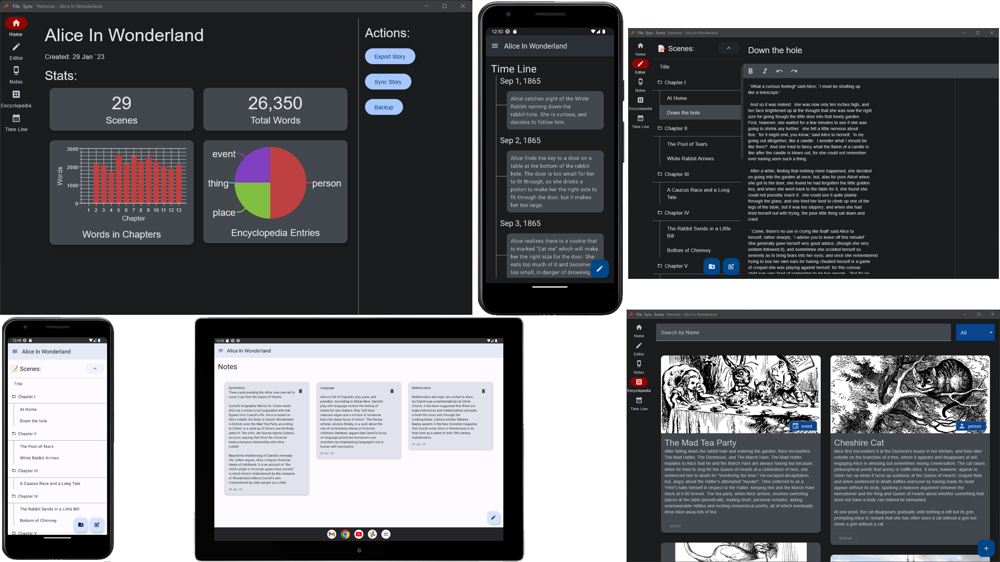

#  Hammer: A story editor

A simple tool for building stories.

   

![badge-kotlin]

![badge-platform-android] ![badge-platform-windows] ![badge-platform-linux] ![badge-platform-macos]

### Available on:

### _**Note:** This is currently Alpha quality software, users beware!_

Take a look at the [Roadmap](docs/ROADMAP.md) to see whats coming.

### Community
Join our [Discord](https://discord.gg/GTmgjZcupk) and help us by reporting bugs, making feature requests, and discussing
the future of Hammer.

Or visit us on Reddit at [r/hammereditor](https://www.reddit.com/r/hammereditor/)

## Multi-platform

This app is where ever you are. Your phone, tablet, desktop, laptop, this program can be installed and run, not simply a
website-in-a-box, but instead using native client side technologies to provide the best experience possible.

### Will add support for more platforms in the future:

- ![badge-platform-ios]

## Multi-Screen

Whether you are on a phone, tablet, or desktop, Hammer will make the best use of your screen space.
Also supporting both light and dark modes.

## Offline first

I was frustrated with most of the story writing software I was finding as they were using web technologies (_aka: Web
Page in a box_) which always seems to run into problems while being used offline for long periods of time. Hammer is
designed from the ground up to be entirely local, no internet connection required, ever.

## Transparent Data

Your data is yours. It's not stored in the cloud, or some opaque database. It is stored in simple, human readable files,
just using files and folders to define the project structure. You can open your OSes file browser and take a look for
your self. If this program went away today you would be able to easily interact with your data.

## Intelligent Syncing between devices

Your data can be synchronized between devices allowing you to work on your story from anywhere, and have no fear of a
change on one device, overwriting a change on another device.

## Optional and Self hosted Syncing

Syncing is entirely optional, you can install the client and use it on one device, or you can
install the server and
sync your data between devices. You could even use some other service to sync your data, like
Dropbox or Google Drive.
It's all up to you. Instructions can be found [here](docs/HOW-TO-RUN-A-SERVER.md).

If you don't know how, or just don't want to setup your own server, we're also running an official
syncing server.

### Official Server: [hammer.ink](https://hammer.ink/)
while we're still early in development here, the official server is invite only. but I'll approve anyone for now, just ask.

We're also running a test environment here: [test.hammer.ink](https://test.hammer.ink/) which is always running the latest commit.

_Do not use the test environment for real data! It will get cleared from time-to-time without notice!_

# Development

Want to contribute? Great! [Here are some instructions to get you started](DEVELOPMENT.md).

<!-- TAG_DEPENDENCIES -->

[badge-kotlin]: https://img.shields.io/badge/kotlin-blue.svg?logo=kotlin

<!-- PLATFORMS -->

[badge-platform-linux]: http://img.shields.io/badge/platform-linux-2D3F6C.svg?style=flat

[badge-platform-android]: http://img.shields.io/badge/platform-android-6EDB8D.svg?style=flat

[badge-platform-ios]: http://img.shields.io/badge/platform-ios-CDCDCD.svg?style=flat

[badge-platform-windows]: http://img.shields.io/badge/platform-windows-4D76CD.svg?style=flat

[badge-platform-macos]: http://img.shields.io/badge/platform-macos-111111.svg?style=flat
