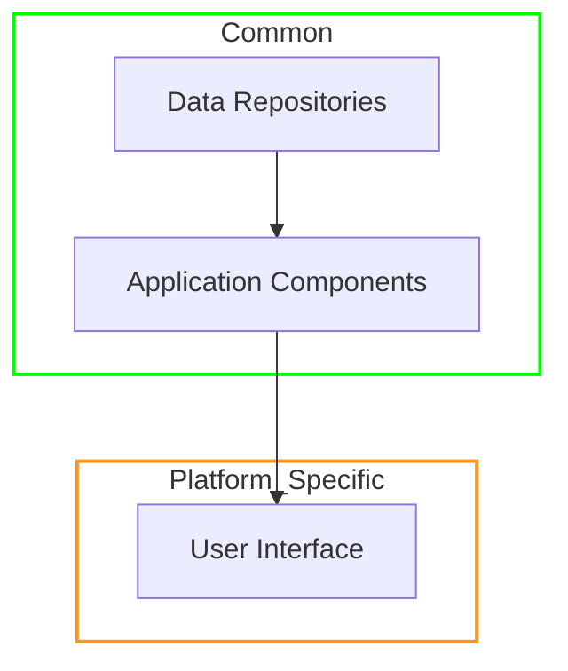
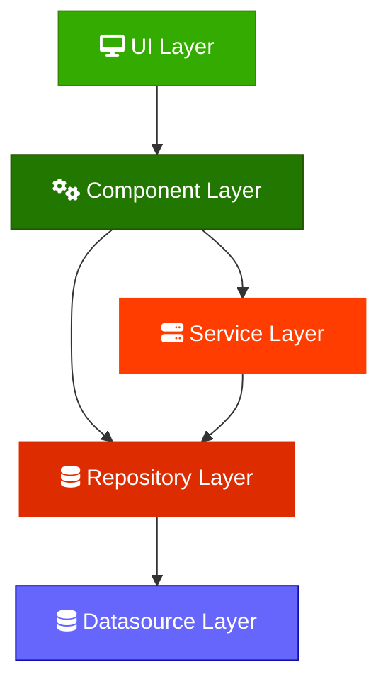
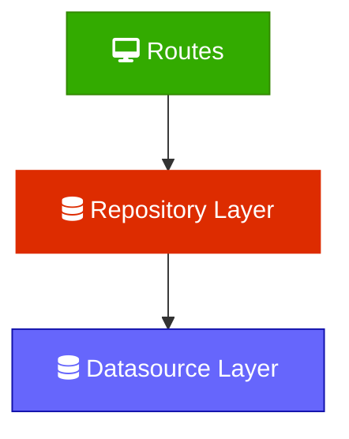

# Software Architecture

In theory each layer of the architecture should only reference entities from the layer below it. In general they should avoid accessing entities from the layer they belong to.

This is all a work in progress, so how strictly this is adhered to is in flux.

## Client Architecture

### Multiplatform Code

The architecture broadly breaks down into two categories, `common` code that compiles and runs on
all supported platforms, and `platform specific` which much be implemented for each of the client
platforms.

The majority of code falls under `common` with only the UI layers and some glue code having to be
reimplemented per platform.

### Architecture Layers

### UI
The UI is a dumb and stateless as possible, each platform can have it's own implementation of this layer.

### Component
(_AKA: ViewModel in other architectures_)

These have a one-to-one relationship with UI elements. They are stateful and contain business logic.

### ~~Use Cases (not used at the moment)~~
~~Contains business logic, is stateless and can combine Services and Repositories~~

### Services
These are stateful and may combine multiple Repositories.

### Data Repositories
These use stateful and responsible for transforming, validating, and caching data from the Datasources, and vending it to the layers above.

### Datasource
Stateless entities for accessing Data.

## Server Architecture

### Routes
These are the HTTP handlers that define the various endpoints. They unmarshal data from HTTP requests, call into Repositories, and then marshal data back into HTTP responses.

### Repositories
These use stateful and responsible for transforming, validating, and caching data from the Datasources, and vending it to the layers above.

### Datasource
Stateless classes for accessing Data.
