# Synchronization Protocol

This doc will try to give a breif (_as possible_) overview of the client/server synchronization
protocol Hammer
uses.

## Goal

The goal of this protocol is to synchronize the various `Entities` on each client to the server.

There is no file history as in a true version control system such as `git`. The way to think about
this protocol is more as a simpler synchronization system. However it is smart enough to detect
conflicts: the same file that has been edited in different ways on different devices, must allow the
user to resolve the conflict.

As such, there is very little book keeping data, and none of it is actually required. When all
actors are fully synchronized, they all contain the full set of data. Thus if the server were to die
and lose all of its data, it wouldn't matter. Every client would contain everything necessary to
setup on a new server.

## Terminology

**Entity** any individual block of data. Each entity is given a unique ID. Examples include:

- Scene
- Scene Draft
- Timeline Event
- Encyclopedia Entry
- Note

**Entity ID** Every Entity is given an Entity ID, which is a unique, monotonically incrementing
integer, with the first valid ID being 1

**Sync ID** This is a UUID generated by the server and passed back to the client identifying a
particular syncing session to a particular client. The server will only all one syncing session per
account at a time to prevent race conditions.

**Entity Update Sequence** A list of Entity IDs in a particular order determined by the server.
The client will update these IDs in the provided order. The server will leave out IDs of Entities
that do not need synchronization.

**Re-ID** The process of taking a client side Entity and issuing it a new ID, changing any
references to that ID in the process.

**Dirty Entity** When a client edits a local Entity, the client first hashes the existing,
pre-edited content, and saves off the **Entity ID** and this pre-edit hash of the data to a "dirty
list". If the client and server are in sync at the time of this edit, then the saved hash in the
dirty list will match the hash of the server's copy of the Entity.
At syncing time this allows us to detect conflicts. If another client edits the same entity, and
syncs with the server first.
Thus our local "dirty list" hash will not match the hash of the server side copy, and we'll know we
have a conflict that needs resolving.

**Account Sync** This synchronizes what projects the Account has, creating or deleting just the top
level directories on the client

**Project Sync** This synchronizes an individual project and all of it's Entities

## Account Sync Protocol

Before any project level syncing is done, we must first do an Account level sync.

This will handle creating, deleting, and renaming projects, to bring the client and server into
parity with each other.
Additionally, it will find or create a `projectId` for the client's local projects. These are the
key to being able to sync a local project with the server.

Any given user account may only have one sync in progress at a time. Attempting to start a sync when
one is already in progress will result in a failure to begin the sync.

```mermaid
sequenceDiagram
	participant Client as Client
	participant Server as Server

	rect rgb(1, 59, 15)
		Client ->> Server: GET /projects/{userId}/begin_sync
		activate Server
		Note right of Client: bearer token
		Server -->> Client: 200 OK (Sync Began)
		deactivate Server
		activate Client
		Note left of Server: syncId<br/>projects<br/>deletedProjects
		alt Sync already in progress
			Server -x Client: 400 Bad Request (sync ends here)
		end
	end
	rect rgb(11, 0, 74)
		loop Rename Projects
			Client ->> Server: GET /api/projects/{userId}/rename
			deactivate Client
			activate Server
			Note right of Client: bearer token <br/> syncId <br/> projectId <br/> projectName
			Server -->> Client: 200 OK (Rename successful)
			deactivate Server
			activate Client
			alt Rename fails
				Server -->> Client: 4XX Bad Request
			end
		end
	end

	rect rgb(74, 0, 9)
		loop Delete Projects
			Client ->> Server: GET /api/projects/{userId}/delete
			deactivate Client
			activate Server
			Note right of Client: bearer token <br/> syncId <br/> projectId
			Server -->> Client: 200 OK (Delete successful)
			deactivate Server
			activate Client
			alt Delete fails
				Server -->> Client: 4XX Bad Request
			end
		end
	end

	rect rgb(49, 0, 74)
		loop Create Projects
			Client ->> Server: GET /api/projects/{userId}/{projectName}/create
			deactivate Client
			activate Server
			Note right of Client: bearer token <br/> syncId <br/> projectName
			Server -->> Client: 200 OK (projectId)
			deactivate Server
			activate Client
			alt Creation fails
				Server -->> Client: 4XX Bad Request
			end
		end
	end

	rect rgb(0, 15, 6)
		Client ->> Server: GET /api/projects/{userId}/end_sync
		deactivate Client
		activate Server
		Note right of Client: bearer token <br/> syncId
		Server -x Client: 200 OK (Sync completed)
		deactivate Server
	end

```

## Project Sync Protocol

- Client makes a request to begin a syncing session:
	- `/api/project/$userId/$projectName/begin_sync`
	- The client crawls all of it's local entities, and hashes each one using `MurmurHash3`
	- The request body is a JSON serialized `ClientEntityState` which is then gziped
- Server then crawls all of its entities, hashing each one and comparing to the hash provided by the
  Client
	- The server is building up a `ProjectSynchronizationBegan` to be JSON serialized and returned
	  in the response body. Part of this is a sorted list of **Entity ID**s, called the **Entity
	  Update Sequence**.
	- If the server does not recognize the **Entity ID**, then it is added to the **Update Sequence
	  **.
	- If the server does recognize it, then the Server side version of the Entity is hashed, and
	  compared to the Client Hash of that Entity. If they do not match, the ID is added to the
	  Update Sequence.
	- The order of the **Update Sequence** is not strictly linear, nested scenes for instance will
	  have their parent Scenes higher in the list so they are synchronized first
	- If everything is correct, a `syncId` will be generated as part of the response payload. The
	  client must provide this for all subsequent calls to the syncing session.
- The client now looks at the `lastId` property returned from the server. If the client has any new
  IDs that are after the server's `lastId` it will perform a **Re-ID** on those Entities, giving
  them new IDs that are higher than the server's `lastId`
- The client handles any **Entity IDs** that the server has listed as deleted, by deleting all local
  artifacts relating to that **Entity ID**
- The client then iterates over it's list of IDs that have been locally deleted since the last
  Server Synchronization Session, and notifies the server with a call
  to `/api/project/$userId/$projectName/delete_entity/$id` for each **Entity ID**
- The client takes the server provided **Entity Update Sequence**, and adds any newly created *
  *Entity IDs** to the bottom of the list
- The client now iterates over the **Combined Entity Update Sequence** processing each **Entity ID**
  in serial.
	- _**Important note:** While different projects may be synchronized in parallel, Entities within
	  a given project must be synchronized serially._
	- For each **Entity ID** in the sequence:
		- Check to see if the client has it marked as **Dirty**, if it is, or the server hasn't seen
		  our ID before, we want to upload our copy of the Entity
			- Upload: `/api/project/$userId/$projectName/upload_entity/${entity.id}`
			- We include both the content of the Entity, as well as the Original Hash of the content
			  before the changes were made. If this original hash matches what the server has right
			  now, then the server simply overwrites it's local copy with ours
			- Conflict: If the server's hash of the entity does _NOT_ match our original hash, then
			  the server will return an HTTP Status 409 along with a response body containing the
			  server's version of the Entity contents. The client must then resolve the conflict,
			  and then re-upload the newly resolved content, but this time with the `force=true`
			  query string parameter
		- If the client doesn't have the **Entity ID** in it's "dirty list" then it will simply
		  download the server's copy and overwrite the local content
			- Download: `/api/project/$userId/$projectName/download_entity/$entityId`
- To terminate the sync session once each ID in the sequence has been processed, the client calls:
	- `/api/project/$userId/$projectName/end_sync`

